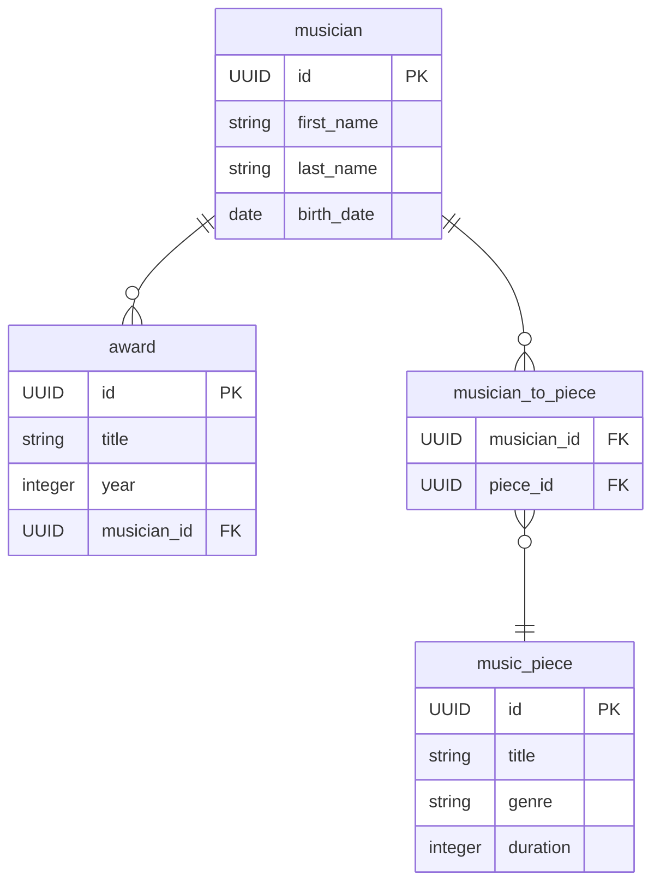

# simpleCRUD

```mermaid
erDiagram
    award {
        UUID id PK
        string title
        integer year
        UUID musician_id FK
    }
    music_piece {
        UUID id PK
        string title
        string genre
        integer duration
    }
    musician {
        UUID id PK
        string first_name
        string last_name
        date birth_date
    }
    musician_to_piece {
        UUID musician_id FK
        UUID piece_id FK
    }

    musician ||--o{ musician_to_piece : ""
    musician_to_piece }o--|| music_piece : ""
    musician ||--o{ award : ""
```
